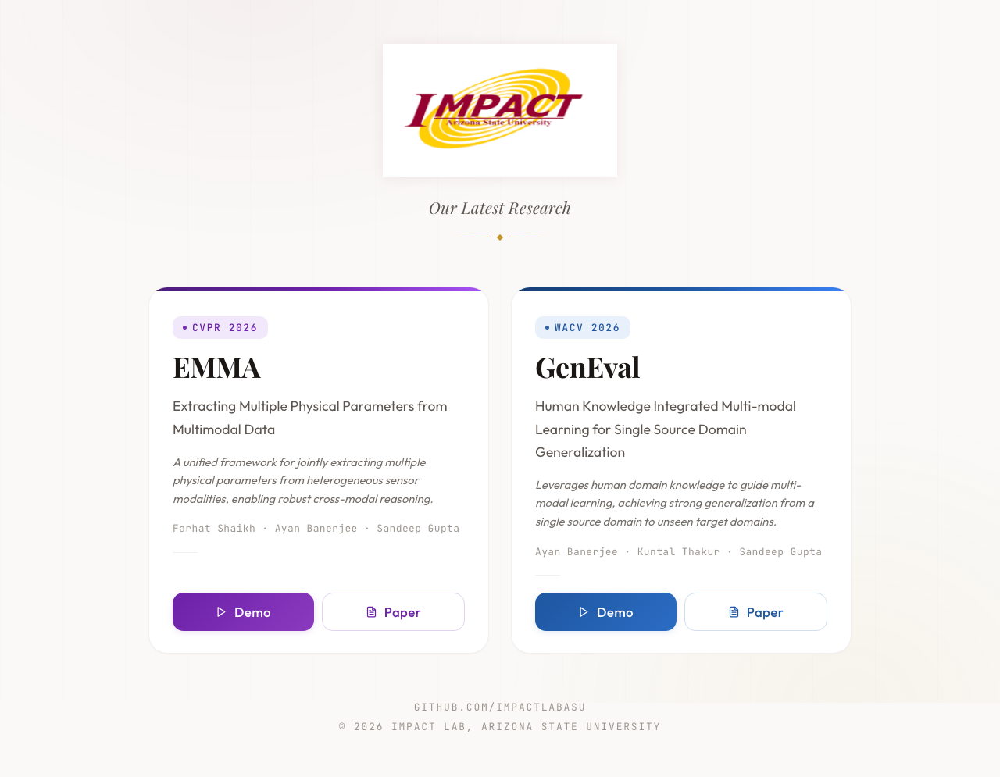

# IMPACT Lab — Latest Research

[](https://impactlabasu.github.io/EMMA-x-GenEval/)
[](https://github.com/ImpactLabASU/EMMA-x-GenEval)

Landing page showcasing recent publications from the [IMPACT Lab](https://github.com/ImpactLabASU) at Arizona State University. The page highlights our latest work in multimodal learning and domain generalization, accepted at top computer vision conferences.

## Preview



## Featured Papers

### EMMA — CVPR 2026

**Extracting Multiple Physical Parameters from Multimodal Data**

*Farhat Shaikh, Ayan Banerjee, Sandeep Gupta*

A unified framework for jointly extracting multiple physical parameters from heterogeneous sensor modalities, enabling robust cross-modal reasoning.

[Paper (PDF)](https://drive.google.com/file/d/1i4cLcJMLSpkWIlu_tTcwcBqmbfPB34Pe/view?usp=drive_link)

---

### GenEval — WACV 2026

**Human Knowledge Integrated Multi-modal Learning for Single Source Domain Generalization**

*Ayan Banerjee, Kuntal Thakur, Sandeep Gupta*

Leverages human domain knowledge to guide multi-modal learning, achieving strong generalization from a single source domain to unseen target domains.

[Paper](https://openaccess.thecvf.com/content/WACV2026/html/Banerjee_Human_Knowledge_Integrated_Multi-modal_Learning_for_Single_Source_Domain_Generalization_WACV_2026_paper.html) | [Demo Video](https://youtu.be/l1tPit0_ay8)

## Local Development

This is a static site — no build step required.

```bash
# Clone the repo
git clone https://github.com/ImpactLabASU/EMMA-x-GenEval.git

# Open in browser
open index.html
```

## License

This project page is shared for academic purposes. Please cite the original papers if you use any content.
